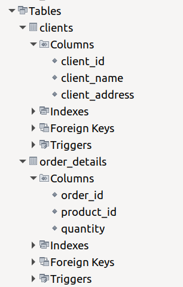

# goit-rdb-hw-02

## Початкова таблиця

```
+----------+------------------------------------------+-----------------------------+-------------------------------+--------------------+
| №        | НазваТоваруКількість                     | Адреса_кліента              | Дата_замовлення               | Кліент             |
+----------+------------------------------------------+-----------------------------+-------------------------------+--------------------+
| 101      | Лептоп: 3, Мишка: 2                      | Хрещатик 1                  | 2023-03-15                    | Мельник            |
| 102      | Принтер: 1                               | Басейна 2                   | 2023-03-16                    | Шевченко           |
| 103      | Мишка: 4                                 | Комп'ютерна 3               | 2023-03-17                    | Коваленко          |
+----------+------------------------------------------+-----------------------------+-------------------------------+--------------------+
```

## 1. Переведіть початкову таблицю в першу нормальну форму.

```
+-------------+----------------+----------+-------------------------+--------------+--------------------+
| account_num | product_name   | quantity | client_address          | account_date | client             |
+-------------+----------------+----------+-------------------------+--------------+--------------------+
|         101 | Лептоп         |        3 | Хрещатик 1              | 2023-03-15   | Мельник            |
|         101 | Мишка          |        2 | Хрещатик 1              | 2023-03-15   | Мельник            |
|         102 | Принтер        |        1 | Басейна 2               | 2023-03-16   | Шевченко           |
|         103 | Мишка          |        4 | Комп'ютерна 3           | 2023-03-17   | Коваленко          |
+-------------+----------------+----------+-------------------------+--------------+--------------------+
```

## 2. Переведіть нові таблиці в другу нормальну форму.

### orders

```
+-----------+--------------------+-------------------------+
| order_num | client             | client_address          |
+-----------+--------------------+-------------------------+
|       101 | Мельник            | Хрещатик 1              |
|       102 | Шевченко           | Басейна 2               |
|       103 | Коваленко          | Комп'ютерна 3           |
+-----------+--------------------+-------------------------+
```

### order_details

```
+-----------+----------------+----------+------------+
| order_num | product_name   | quantity | order_date |
+-----------+----------------+----------+------------+
|       101 | Лептоп         |        3 | 2023-03-15 |
|       101 | Мишка          |        2 | 2023-03-15 |
|       102 | Принтер        |        1 | 2023-03-16 |
|       103 | Мишка          |        4 | 2023-03-17 |
+-----------+----------------+----------+------------+
```

## 3. Переведіть нові таблиці в третю нормальну форму.

### clients

```
+-----------+---------------------+-------------------------+
| client_id | client_name         | client_address          |
+-----------+---------------------+-------------------------+
|         1 | Мельник             | Хрещатик 1              |
|         2 | Шевченко            | Басейна 2               |
|         3 | Коваленко           | Комп'ютерна 3           |
+-----------+---------------------+-------------------------+
```

### products

```
+------------+----------------+
| product_id | product_name   |
+------------+----------------+
|          1 | Лаптоп         |
|          2 | Мишка          |
|          3 | Принтер        |
+------------+----------------+
```

### orders

```
+----------+-----------+------------+
| order_id | client_id | order_date |
+----------+-----------+------------+
|      101 |         1 | 2023-03-15 |
|      102 |         2 | 2023-03-16 |
|      103 |         3 | 2023-03-17 |
+----------+-----------+------------+
```

### order_details

```
+----------+------------+----------+
| order_id | product_id | quantity |
+----------+------------+----------+
|      101 |          1 |        3 |
|      101 |          2 |        2 |
|      102 |          3 |        1 |
|      103 |          1 |        4 |
+----------+------------+----------+
```

## ER diagram


## database schema

```
mysql> show tables;
+-----------------------+
| Tables_in_new_schema1 |
+-----------------------+
| clients               |
| order_details         |
| orders                |
| products              |
+-----------------------+
4 rows in set (0,08 sec)

mysql> describe clients;
+----------------+-------------+------+-----+---------+-------+
| Field          | Type        | Null | Key | Default | Extra |
+----------------+-------------+------+-----+---------+-------+
| client_id      | int(11)     | NO   | PRI | NULL    |       |
| client_name    | varchar(45) | YES  |     | NULL    |       |
| client_address | varchar(45) | YES  |     | NULL    |       |
+----------------+-------------+------+-----+---------+-------+
3 rows in set (0,02 sec)

mysql> describe orders;
+------------+-------------+------+-----+---------+-------+
| Field      | Type        | Null | Key | Default | Extra |
+------------+-------------+------+-----+---------+-------+
| order_id   | int(11)     | NO   | PRI | NULL    |       |
| client_id  | int(11)     | YES  | MUL | NULL    |       |
| order_date | varchar(10) | YES  |     | NULL    |       |
+------------+-------------+------+-----+---------+-------+
3 rows in set (0,06 sec)

mysql> describe products;
+--------------+-------------+------+-----+---------+-------+
| Field        | Type        | Null | Key | Default | Extra |
+--------------+-------------+------+-----+---------+-------+
| product_id   | int(11)     | NO   | PRI | NULL    |       |
| product_name | varchar(45) | YES  |     | NULL    |       |
+--------------+-------------+------+-----+---------+-------+
2 rows in set (0,02 sec)

mysql> describe order_details;
+------------+---------+------+-----+---------+-------+
| Field      | Type    | Null | Key | Default | Extra |
+------------+---------+------+-----+---------+-------+
| order_id   | int(11) | YES  | MUL | NULL    |       |
| product_id | int(11) | YES  | MUL | NULL    |       |
| quantity   | int(11) | YES  |     | NULL    |       |
+------------+---------+------+-----+---------+-------+
3 rows in set (0,02 sec)

```

```mysql
SELECT
    TABLE_NAME,
    COLUMN_NAME,
    CONSTRAINT_NAME,
    REFERENCED_TABLE_NAME,
    REFERENCED_COLUMN_NAME
FROM
    INFORMATION_SCHEMA.KEY_COLUMN_USAGE
WHERE
    TABLE_SCHEMA = 'new_schema1';
```

```
+---------------+-------------+--------------------+-----------------------+------------------------+
| TABLE_NAME    | COLUMN_NAME | CONSTRAINT_NAME    | REFERENCED_TABLE_NAME | REFERENCED_COLUMN_NAME |
+---------------+-------------+--------------------+-----------------------+------------------------+
| clients       | client_id   | PRIMARY            | NULL                  | NULL                   |
| clients       | client_id   | client_id_UNIQUE   | NULL                  | NULL                   |
| order_details | order_id    | fk_order_details_1 | orders                | order_id               |
| order_details | product_id  | fk_order_details_2 | products              | product_id             |
| orders        | order_id    | PRIMARY            | NULL                  | NULL                   |
| orders        | order_id    | order_id_UNIQUE    | NULL                  | NULL                   |
| orders        | client_id   | fk_orders_1        | clients               | client_id              |
| products      | product_id  | PRIMARY            | NULL                  | NULL                   |
| products      | product_id  | product_id_UNIQUE  | NULL                  | NULL                   |
+---------------+-------------+--------------------+-----------------------+------------------------+

```

```mysql
SELECT
    kcu.TABLE_NAME AS child_table,
    kcu.COLUMN_NAME AS child_column,
    kcu.CONSTRAINT_NAME AS constraint_name,
    kcu.REFERENCED_TABLE_NAME AS parent_table,
    kcu.REFERENCED_COLUMN_NAME AS parent_column,
    tc.CONSTRAINT_TYPE AS constraint_type
FROM
    INFORMATION_SCHEMA.KEY_COLUMN_USAGE kcu
JOIN
    INFORMATION_SCHEMA.TABLE_CONSTRAINTS tc
    ON kcu.CONSTRAINT_NAME = tc.CONSTRAINT_NAME
    AND kcu.TABLE_SCHEMA = tc.TABLE_SCHEMA
WHERE
    kcu.TABLE_SCHEMA = 'new_schema1'
    AND tc.CONSTRAINT_TYPE = 'FOREIGN KEY';
```

```
+---------------+--------------+--------------------+--------------+---------------+-----------------+
| child_table   | child_column | constraint_name    | parent_table | parent_column | constraint_type |
+---------------+--------------+--------------------+--------------+---------------+-----------------+
| order_details | order_id     | fk_order_details_1 | orders       | order_id      | FOREIGN KEY     |
| order_details | product_id   | fk_order_details_2 | products     | product_id    | FOREIGN KEY     |
| orders        | client_id    | fk_orders_1        | clients      | client_id     | FOREIGN KEY     |
+---------------+--------------+--------------------+--------------+---------------+-----------------+

```




## database creating script

[database creating script](./create_db.sql)
